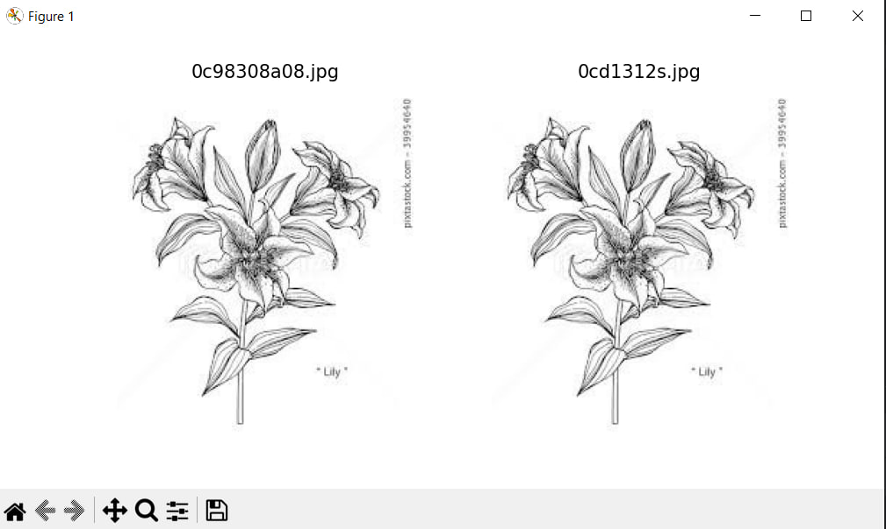

# Image Duplicate Finder

This project is designed to find duplicate images in a specified directory using deep learning and image hashing models.



## Description

The script performs the following tasks:
1. Scanning the specified directory to find images.
2. Processing the images using EfficientNetB0 model for feature extraction.
3. Computation of image hashes using `imagehash` library.
4. Finding duplicate images based on similarity of features and hashes.
5. Visualization of the found duplicates.

## Requirements

The following libraries are required for the project to work:

- `numpy`
- `Pillow`
- `matplotlib`
- `imagehash`
- `keras`
- `tensorflow`

You can install all the necessary dependencies using the file `requirements.txt`:

```bash
pip install -r requirements.txt
```
## License

This project is licensed under the MIT License. See the LICENSE file for details.


